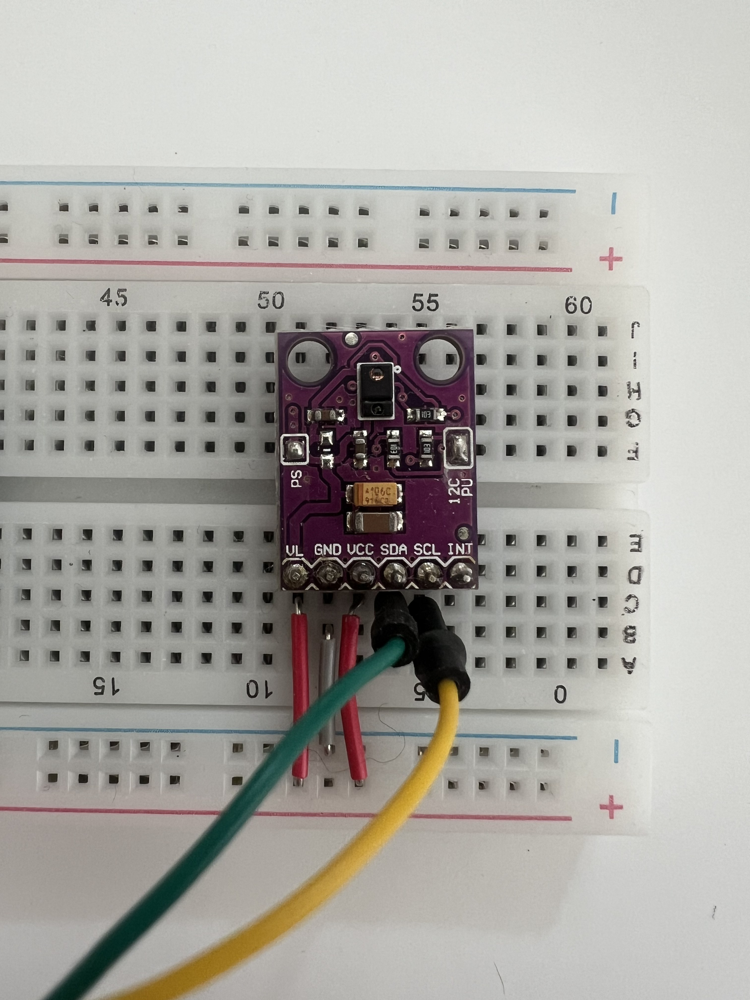

# APDS9960 · Gestensensor

Der APDS9960 ist der Standard-Eingabesensor im Workshop. Er erkennt Handbewegungen, die nah an der Sensoroberfläche ausgeführt werden.

---

## Was er erkennt

- Wischgesten (links, rechts, oben, unten)
- Nähe (wie weit ist eine Hand entfernt)
- Umgebungslicht und Farbe (im Workshop nicht verwendet)

## Wie er im GPT beschrieben wird

Im Prompt musst du den Sensor nicht beim Namen nennen. Es genügt zu sagen:

> „...gesteuert durch eine Handbewegung..."
> „...wenn jemand die Hand über den Sensor hält..."
> „...ausgelöst durch eine Geste..."

Der GPT wählt automatisch den APDS9960 als Standard-Eingabesensor, wenn kein anderer angegeben ist.

## Anschluss

Verbunden über I²C:
- SDA → GPIO 21
- SCL → GPIO 22

Bibliothek: `Adafruit APDS9960 Library`
