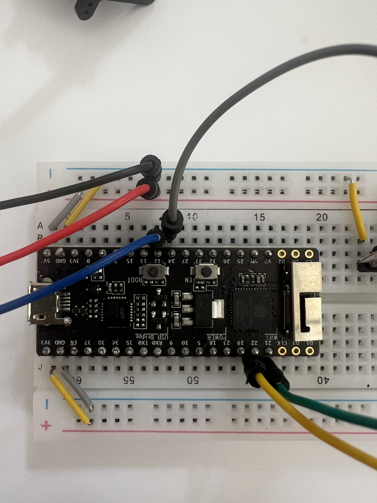

# ESP32 Pico · Mikrocontroller

Der ESP32 ist der zentrale Baustein des Workshops. Er führt den Code aus, kommuniziert mit Sensoren und Aktoren, und verbindet sich über WLAN mit anderen Geräten.

---

## Was er kann

- Code ausführen (Arduino-Framework)
- Über I²C mit Sensoren kommunizieren (APDS9960, MPU6050)
- Digitale Signale senden (NeoPixel, Servo)
- Sich über WLAN mit einem WebSocket-Server verbinden (PairLink)

## Feste Pins im Workshop

Alle Anschlüsse sind vorbestimmt — der GPT kennt sie und verwendet sie automatisch:

| Funktion | Pin |
|---|---|
| Button (Pairing) | GPIO 0 |
| Status-LED | GPIO 2 |
| Servo | GPIO 12 |
| NeoPixel | GPIO 14 |
| I²C SDA (Sensoren) | GPIO 21 |
| I²C SCL (Sensoren) | GPIO 22 |

Du musst diese Nummern nicht kennen. Sie sind im GPT hinterlegt.

---

## Referenzen & Dokumentation

| Ressource | Link |
|---|---|
| ESP32 Datenblatt (Espressif) | [espressif.com · PDF](https://www.espressif.com/sites/default/files/documentation/esp32_datasheet_en.pdf) |
| ESP32 Technical Reference Manual | [docs.espressif.com](https://docs.espressif.com/projects/esp-idf/en/latest/esp32/hw-reference/index.html) |
| Arduino-ESP32 Dokumentation | [docs.espressif.com/arduino-esp32](https://docs.espressif.com/projects/arduino-esp32/en/latest/) |
| Arduino-ESP32 GitHub | [github.com/espressif/arduino-esp32](https://github.com/espressif/arduino-esp32) |
| PlatformIO ESP32 Board-Konfiguration | [docs.platformio.org](https://docs.platformio.org/en/latest/boards/espressif32/esp32dev.html) |
| Espressif32 PlatformIO Platform (GitHub) | [github.com/platformio/platform-espressif32](https://github.com/platformio/platform-espressif32) |
