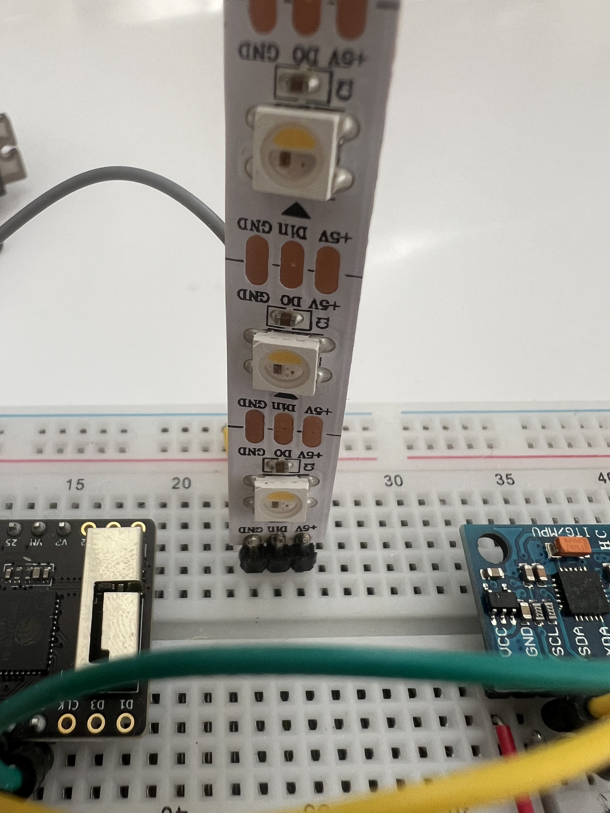

# NeoPixel Strip · LED-Streifen

Der NeoPixel-Strip besteht aus 6 einzeln ansteuerbaren LEDs. Jede LED kann jede Farbe darstellen und unabhängig von den anderen leuchten.

---

## Was er kann

- Helligkeit stufenlos regeln (0 = aus, 255 = maximale Helligkeit)
- Jede Farbe darstellen (RGB + Weißkanal)
- Animationen, Sequenzen, Verläufe darstellen

## Wie er im Prompt beschrieben wird

> „...die LEDs leuchten heller wenn..."
> „...der Strip zeigt die Intensität der Bewegung..."
> „...6 Pixel reagieren auf den Sensorwert..."

## Anschluss

- Datenleitung → GPIO 14
- Typ: GRBW + KHZ800

Bibliothek: `Adafruit NeoPixel`
